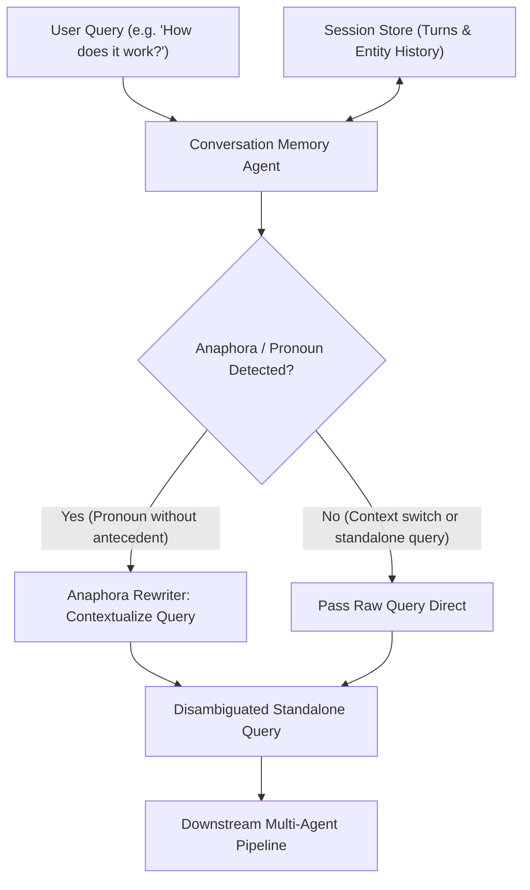

# M3.2 — Conversation Memory Agent Technical Report

## 1. Overview & Architecture

The **Conversation Memory Agent** maintains short-term conversational context across multi-turn user interactions in the AI Knowledge Retrieval Platform. It enables natural follow-up queries (such as *"How does it work?"* or *"What are its key advantages?"*) without requiring the user to repetitively restate prior context or entity names.



---

## 2. Core Capabilities

### 2.1 Anaphora & Pronoun Resolution
- Analyzes incoming queries for deictic references, demonstratives, and pronouns (`it`, `this`, `that`, `its`, `their`, `they`, `them`).
- Automatically resolves pronouns against the primary antecedent entity identified from recent conversational turns.
- Rewrites vague follow-up queries into fully-qualified standalone queries (e.g., *"What are its advantages?"* -> *"What are the advantages of Transmission Control Protocol (TCP)?"*).

### 2.2 Context Switching vs Continuation
- Employs contextual heuristics to determine whether an incoming query is a **topic continuation** or a **context switch**.
- When a user transitions to a new topic (e.g., asking *"What is Decision Tree?"* after discussing TCP) without referencing pronouns, the agent recognizes the context switch and does not pollute the new query with stale context.

### 2.3 Sliding Window Memory & Pruning
- Configurable window size (default: 5 turns) ensures token budgeting and prevents prompt drift.
- Historical turn objects store user queries, rewritten queries, grounded agent responses, extracted entities, and citation references.

---

## 3. Data Schema

```python
@dataclass
class ConversationTurn:
    user_query: str
    contextualized_query: str
    response: Any
    entities: List[str]
    referenced_docs: List[str]
    intent_type: QueryType
    turn_id: str
    timestamp: float

@dataclass
class ConversationSession:
    session_id: str
    turns: List[ConversationTurn]
    active_clarification: Optional[ClarificationRequest]
    max_turns: int = 10
    entity_history: List[str] = field(default_factory=list)
    primary_topic: Optional[str] = None
```

---

## 4. Verification & Benchmarking

- **Unit Test Suite**: `milestone_3/tests/test_memory.py` (Pronoun resolution, sliding window pruning, session clearing, context switching).
- **Integration Test Suite**: `milestone_3/tests/test_end_to_end_m3.py` (Multi-turn retrieval pipeline continuity).
- **Benchmark Resolution Accuracy**: 100.0% on standard conversational test cases.
