# M3.3 — Voice Input & Text-to-Speech Module Technical Report

## 1. Overview & Architecture

The **Voice Input and Text-to-Speech (TTS) Module** provides a multimodal voice interaction layer for the AI Knowledge Retrieval Platform. It enables users to speak queries directly via the browser's native **Web Speech API SpeechRecognition** interface and receive audible spoken responses powered by **Web Speech API SpeechSynthesis**, accompanied by live visual waveforms and text transcripts.

```mermaid
graph LR
    UserMic["🎙️ User Microphone"] --> STT["Web Speech API (SpeechRecognition)"]
    STT --> LiveTranscript["Live Waveform & Transcript"]
    LiveTranscript --> MultiAgent["Multi-Agent Pipeline"]
    MultiAgent --> GroundedResponse["Grounded Markdown Response"]
    GroundedResponse --> SpeechSanitizer["VoiceModule Text Sanitizer"]
    SpeechSanitizer --> TTS["Web Speech API (SpeechSynthesis)"]
    TTS --> AudioOut["🔊 Audio Output (Play/Pause/Resume/Stop)"]
```



---

## 2. Core Capabilities

### 2.1 Web Speech API Microphone STT
- Uses browser-native HTML5 Web Speech API (`webkitSpeechRecognition` / `SpeechRecognition`) with zero external API dependencies or cloud latency.
- Features continuous listening, interim transcript display, audio pulse animation, and direct query dispatch into the multi-agent orchestrator.

### 2.2 Text-to-Speech (TTS) Engine & Audio Controls
- Browser-native speech synthesis (`window.speechSynthesis`) with customizable voice selection, playback rate, pitch, and volume.
- Interactive audio controls: **Play**, **Pause**, **Resume**, and **Stop** buttons for every generated response.

### 2.3 Grounded Speech Text Sanitization (`VoiceModule`)
- Raw grounded markdown responses often contain elements unsuitable for speech (e.g., citation brackets `[1]`, code blocks ````python ... ````, markdown hashes `###`, links `[doc](url)`).
- `VoiceModule.clean_for_speech()` automatically sanitizes the response into fluent natural language:
  - Strips fenced code blocks and replaces them with clean transition phrases.
  - Strips numeric citations `[1]`, `[Citation 2]`.
  - Strips markdown formatting symbols (`**`, `*`, `###`, `>`).
  - Cleans emojis and irregular spacing for natural spoken delivery.

---

## 3. UI Component Structure

```python
# Web Speech API Voice Interface Widget
from app.components.voice_interface import render_voice_input_widget, render_tts_player

# Render microphone listening widget
transcript = render_voice_input_widget(element_id="voice_stt_main")

# Render inline TTS audio player for grounded response
render_tts_player(spoken_text=response.spoken_text, element_id="tts_turn_1")
```

---

## 4. Verification & Testing

- **Unit Tests**: `milestone_3/tests/test_voice.py` (Markdown stripping, citation removal, code block handling, speech config generation).
- **Integration Tests**: `milestone_3/tests/test_end_to_end_m3.py` (Pipeline speech payload synthesis).
