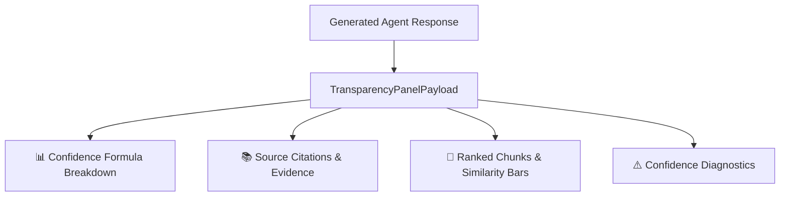

# M3.4 — Response Transparency Panel Technical Report

## 1. Overview & Architecture

The **Response Transparency Panel** provides full explainability, verification, and grounded evidence inspection for every response generated by the AI Knowledge Retrieval Platform. It allows users and auditors to inspect raw retrieved source chunks, similarity scores, rank distributions, the mathematical confidence formula breakdown, and low-confidence diagnostic warnings.



---

## 2. Core Capabilities

### 2.1 Confidence Score Mathematical Calibration
The system computes an empirical confidence score combining top-chunk relevance and neighborhood density:
$$\text{Confidence Score} = 0.70 \times \text{Top-Chunk-Score} + 0.30 \times \text{Average-Top-}K\text{-Score}$$

- **High Confidence ($\ge 0.70$)**: Strong, verifiable evidence directly answering the query.
- **Medium Confidence ($0.50 \le \text{Score} < 0.70$)**: Adequate supporting evidence; answer synthesized with grounding.
- **Low Confidence ($\text{Threshold} \le \text{Score} < 0.50$)**: Marginal evidence; caution recommended.
- **None ($< \text{Threshold}$)**: Insufficient evidence; fallback triggered.

### 2.2 Ranked Chunk Inspector
- Visualizes all retrieved chunks with visual similarity score progress bars (`st.progress`).
- Shows document origin, chunk IDs, page numbers, and full text content in interactive expandable cards.

### 2.3 Citation References & Snippets
- Displays grounded citation tags (e.g. `[1]`, `[2]`) linked directly to exact document snippets.

### 2.4 Low-Confidence Diagnostic Warnings
- Automatically identifies and alerts users to potential failure modes (e.g., top chunk relevance below threshold, lack of corroborating top-$k$ evidence).

---

## 3. UI Component Integration

```python
from app.components.transparency_panel import render_transparency_panel

# Render transparency side panel in Streamlit UI
render_transparency_panel(response.transparency)
```

---

## 4. Verification & Testing

- **Unit Tests**: `milestone_3/tests/test_transparency.py` (Confidence formula validation, high/low confidence boundaries, payload construction).
- **Integration Tests**: `milestone_3/tests/test_end_to_end_m3.py` (Pipeline transparency payload attachment).
