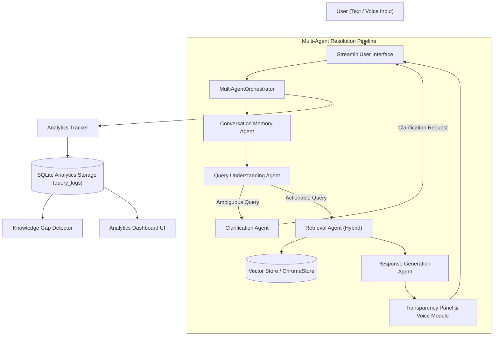

# Milestone 4 — Final Platform Architecture

## 1. System Overview & End-to-End Pipeline

The AI-Based Knowledge Retrieval Platform with Query Resolution System implements an extensible, multi-agent architecture with grounded retrieval, multi-turn memory, voice interaction, and telemetry tracking.

---

## 2. Ingestion & Storage Architecture
- **Ingestion Pipeline (`milestone_4/app/ingestion/pipeline.py`)**:
  - Supports `.txt`, `.csv`, `.pdf` documents.
  - Chunks text using `RecursiveCharacterTextSplitter` configured to **800 characters** with **150 characters overlap**.
  - Attaches domain metadata (`machine_learning`, `computer_networks`, `cybersecurity`).
- **Embeddings (`milestone_4/app/embeddings/embedder.py`)**:
  - Uses `SentenceTransformer("all-MiniLM-L6-v2")` generating 384-dimensional normalized dense vectors.
  - Includes a deterministic n-gram hash vectorizer fallback when native models are absent.
- **Vector Store (`milestone_4/app/vectorstore/chroma_store.py`)**:
  - ChromaDB persistent vector storage with in-memory cosine fallback.

---

## 3. Specialized Multi-Agent Responsibilities

### 1. Conversation Memory Agent (`milestone_4/app/agents/memory.py`)
- Maintains per-session conversation turns.
- Rewrites pronouns ("it", "its", "that") based on antecedents in preceding turns.
- Tracks active domain and handles clean domain switching.

### 2. Query Understanding Agent (`milestone_4/app/agents/query_understanding.py`)
- Cleans and normalizes query text.
- Extracts technical entities and acronyms (filtering interrogative stop words).
- Identifies intent: `FACTUAL`, `PROCEDURAL`, `COMPARATIVE`, `AMBIGUOUS`, `MULTI_PART`.
- Identifies query domain and routes to `RETRIEVAL` or `CLARIFICATION`.

### 3. Clarification Agent (`milestone_4/app/agents/clarification.py`)
- Detects polysemous keywords (`tree`, `clustering`, `handshake`, `routing`, `token`, `signature`) when unqualified.
- Formulates multi-choice clarification requests with follow-up guidance.
- Resolves clarification selections to produce refined, unambiguous queries.

### 4. Retrieval Agent (`milestone_4/app/agents/retrieval.py`)
- Decomposes multi-part queries into sub-questions.
- Computes hybrid scores: 55% dense vector cosine similarity + 45% lexical token overlap.
- Applies a `+0.05` domain affinity bonus.
- Filters candidates against a calibrated threshold (`0.35`).
- Returns Top-K (default 5) sorted evidence chunks.

### 5. Response Generation Agent (`milestone_4/app/agents/response_generation.py`)
- Synthesizes grounded answers strictly from retrieved evidence chunks.
- Computes centralized confidence using `ConfidenceCalculator`.
- Formats evidence sources and inline numerical citations.
- Prepares transparency telemetry and voice-ready text.

### 6. Voice Module (`milestone_4/app/agents/voice.py`)
- Integrates browser Web Speech API (STT & TTS).
- Sanitizes markdown, code blocks, URLs, and citation brackets for natural speech output.
- Provides error guidance for browser microphone and speech API failures.

### 7. Query Analytics & Knowledge Gap Module (`milestone_4/app/analytics/`)
- Persists detailed query telemetry in SQLite (`data/analytics/analytics.db`).
- Discovers knowledge gaps using 6-condition lexical/thematic clustering.
- Displays interactive analytics KPIs, distribution charts, and audit tables in Streamlit.
